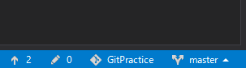

# CTRL Git講習会手順書

本資料は CTRLGit講習会 で行う Sourcetree のインストールからコミットまでの手順書です。

実際に手を動かすことで GitLab と Sourcetree の操作に慣れていきましょう。


## 手順 1 : Sourcetreeのダウンロード

まずは Sourcetree のインストーラーをダウンロードします。

https://ja.atlassian.com/software/sourcetree


## 手順 2 : ライセンスに同意する

インストーラを起動すると以下の画面が開きます。

「ライセンスに同意します」にチェックを付け、続行をクリックします。

SourceTreeに利用データを送って開発に貢献したい人は「Help improve Sourcetree by sending」にもチェックを付けましょう。


## 手順 3 : Atlassianアカウントを作る

Sourcetreeを使うにはAtlassianアカウントが必要です。

「既存のアカウントを使用」をクリックしてアカウントを作成orログインを行います。


---

Googleアカウント連携またはユーザー名+パスワードを入力してアカウントを作ることができます。

今回はユーザー名+パスワードでアカウントを作ることにします。

「Sign up for an account」をクリックし、アカウント作成画面へ移動します。


---

メールアドレス、名前（ハンドルネームでも可）、パスワードを入力し、reCAPTCHAにチェックを付けて「Sign Up」をクリックします。


---

以下の画面になれば成功です。

続行をクリックして次に進みましょう。


## 手順 4 : リモートリポジトリとの接続

今回はGitLabを使うため「スキップ」をクリックします。


## 手順 5 : SSHキーの設定

学内LANはポートレベルでSSHをブロックしているため「No」をクリックします。


## 手順 6 : Gitの設定

コンピュータにGitがインストールされていない場合は以下のような画面が出ます。

「システム全体でなく、Sourcetree単独で使うためだけの内蔵用のGitをダウンロードする。」をクリックしてGitをダウンロードしましょう。


## 手順 7 : Mercurialの設定

コンピュータにMercurialがインストールされていない場合は以下のような画面が出ます。

今回は使わないため、「Mercurialを使いたくない」をクリックします。


---

以下の画面が出たらインストール完了です。


## 手順 8 : グローバルユーザー情報の追加

コミットする際に使うユーザー名とメールアドレスを設定します。

メニューバーから[ツール] - [オプション]を開き、全般タブの「デフォルトユーザー情報」にユーザー名とメールアドレスを入力しましょう。

入力し終えたら「OK」をクリックします。


## 手順 9 : GitLabにリモートリポジトリを作る

リモートリポジトリはWeb上のソースコード置き場です。
GitLabのトップページからNew projectをクリックしましょう。


---

「Project name」はプロジェクトの名前を入力します。好きな名前をつけてください。

「Project description」にはプロジェクトの説明を入力します。1行に収まるくらいがいいかも。  

---

少し話は逸れますが、使い方など詳しい説明が必要なときは、ここの説明ではなく、README.mdファイルに書くとよいです。マークダウンは柔軟性が高いので、頑張れば色々書けます。  

例：  
 

---

「Visibility Level」はプロジェクトにアクセスできる人を設定します。（クローンはできるがプッシュはプロジェクトのメンバーじゃないとできない）

Privateは自分のみ、Internalはログインしているユーザー全員、Publicはログインなしに誰でもアクセスすることができます。  
githubでプライベート（知り合いにのみ公開）なプロジェクトを作るにはお金がかかるので、部のgitlabを積極的に活用していきましょう。


---

プロジェクトの作成に成功すると以下の画面のようになります。


## 手順10 : Siv3Dのプロジェクトを作る

今回はSiv3DでGitを使う場合を練習します。

Visual Studio 2017（2015でも可）のメニューバーから[ファイル] - [新規作成] - [プロジェクト]をクリックします。


新しいプロジェクトというウィンドウが出てきたらVisual C++の内部にあるSiv3D(August2016v2)を選択し、

名前にはGitLabのリポジトリに付けた名前を、

場所にはC:\User\ユーザー名\Documents\Visual Studio 2017\Project\を指定します。

画面右下のソリューションのディレクトリを作成にはチェックを入れ、
新しいGitリポジトリの作成にはチェックを入れないでおきます。

入力が終わったら「OK」をクリックします。


---

F5キーなどで実行するといつもの画面が現れました。


## 手順11 : Siv3D用の.gitignoreの導入

.gitignoreにGitの管理に入れたくないファイルを書いておくと変更を無視してくれます。  
不要なVisual StudioのプロジェクトファイルやSiv3Dのサンプル画像などをそのままgit管理に追加してしまうとかなりの容量を食ってしまうため、それを防ぐためにあらかじめ無視するファイルを設定しておきます。

この設定は始めに行わないといけません。（この後で行う、Visual Studioによるgit初期化はinitだけでなく、勝手にコミットまでしてしまいます。.gitignoreには既にgit管理下にあるファイルに対する効果はないため、後から.girignoreを追加した場合、gitの管理対象から外す作業が必要になるのでかなり面倒です）

Siv3D 用の .gitignoreファイルが公式から提供されているため、それを使います。

下のリンクからダウンロードし、ソリューションのフォルダ内にコピーしてください。

[Siv3D 用の .gitignore](https://github.com/Siv3D/gitignore)


## 手順12 : コマンドプロンプトでSiv3D.gitignoreをリネーム


.gitignoreのような、名前がなく拡張子だけのファイルはwindowsのエクスプローラーからでは作れないので、コマンドプロンプトを使いリネームします。

~~Winキー + Ｒで「ファイル名を指定して実行」を立ち上げ、「cmd」と入力し、「OK」をクリックします。~~

---

注釈：  
フォルダを移動した状態でコマンドプロンプトを起動するときは、エクスプローラのパスに直接cmdと打ち込むと楽です。


---

エクスプローラでソリューションのフォルダを開き、パスにcmdと打ち込むとコマンドプロンプトが立ち上がります。

コマンドプロンプトが立ち上がったら、以下のコマンドを打ち込むかコピペします。（1行ずつ行うこと！）

```powershell
ren Siv3D.gitignore .gitignore
```

ソリューションフォルダを確認すると、「Siv3D.gitignore」が「.gitignore」に変わりました。


## 手順13 : ソリューションをソース管理（Git）に追加する

Visual Studioの画面右下から[ソース管理に追加] - [Git]をクリックします。


以下のようになれば成功です。



## 手順14 : コミットしてみよう

コミットはローカルリポジトリにファイルを保存することです。

前回コミットした時の状態から現在の状態までの差分を保存します。

正確には違いますが、気になったらグーグル先生に聞いてみてください。

コミットの前にプログラムを変更します。

Visual Studioを開き、Main.cppを次のように変更しましょう。

```cpp
# include <Siv3D.hpp>

void Main()
{
	const Font font(30);

	while (System::Update())
	{
		font(L"ようこそ、Siv3D の世界へ！").draw();
		font(L"Hello Git!").drawCenter(Window::Center());

		Circle(Mouse::Pos(), 50).draw({ 255, 0, 0, 127 });
	}
}
```

実行すると、ウィンドウの中央に「Hello Git!」と表示されました。


---

次にSourcetreeでローカルリポジトリを開きます。「Improved Tabs!」（タブが改善されたよ！）が表示されている場合は「Got it」をクリックして閉じておくこと。

C:\Users\ユーザー名\Documents\Visual Studio 2017\Projects\GitPracticeにあるソリューションフォルダをSourcetreeにドラッグ & ドロップしてください。


次にブックマークに追加された「GitPractice」をダブルクリックし、リポジトリを開きます。


開いたらこんなかんじ


次に「作業ツリーのファイル」の下にある「GitPractice/Main.cpp」をクリックします。


次に左のブランチの下にある「○ master」をクリックします。

ブランチ（今回はmaster）をクリックすると

- コミットの樹形図
- コミット情報
- 変更したファイルの一覧
- 変更したファイルの内容

などが表示されます。


コミットする前にリモートリポジトリの設定をしておきます。

画面右上の「設定」をクリックすると「リポジトリの設定」が出てくるので「追加」をクリック。


「リモートの詳細設定」が出てくるので以下の表のようにして　「OK」をクリック。


| 項目                       | 値                                                            |
|----------------------------|---------------------------------------------------------------|
| リモート名　               | origin                                                        |
| URL/パス                   | 自分のGitLabからコピペしよう                                  |


---

左上のコミットボタンをクリックすると、下の画面が表示されます。

コミットコメントにはコミットの説明を書きます。

1行目には概要を、2行目は空行、3行目以降は細かい内容などを書くのが慣例です。

「作業ツリーのファイル」の「GitPractice/Main.cpp」をクリックして選択し、「選択をインデックスを追加」をクリックしましょう。


ステージングされたので、右下の「コミット」をクリックしてコミットします。


無事コミットできました。


講習はここで終了です。お疲れ様でした。

## おまけ

チーム開発でgitを使う場合、git-flowと呼ばれる運用手法を導入するのが一般的です。チーム開発にチャレンジする場合は試してみましょう。  
git-flowについての参考情報などです。自分でもググってみてね

https://qiita.com/KosukeSone/items/514dd24828b485c69a05

http://tttttahiti.hatenablog.com/entry/2015/05/22/132030